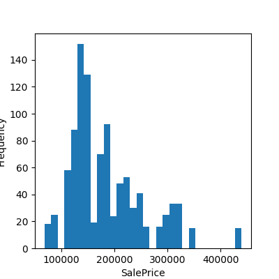
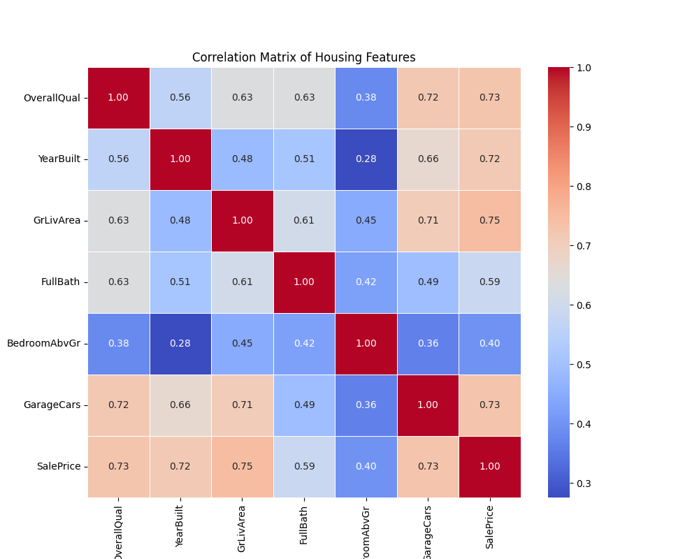
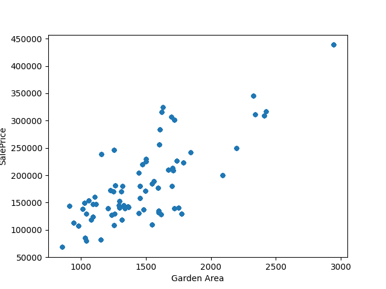
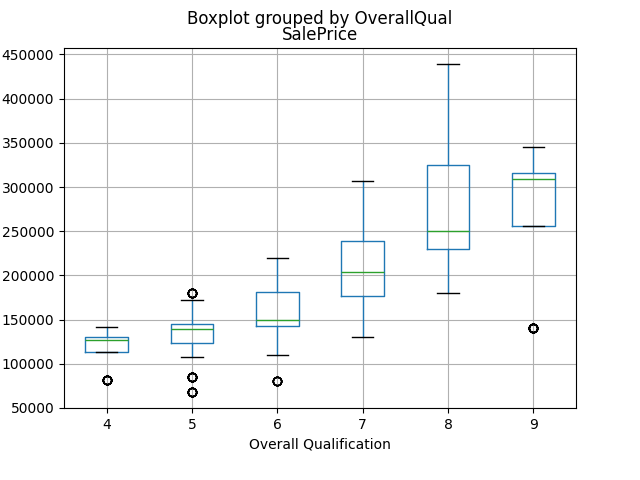
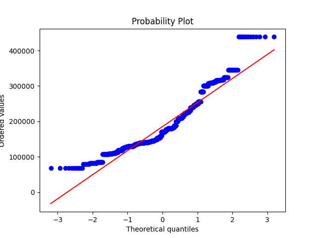
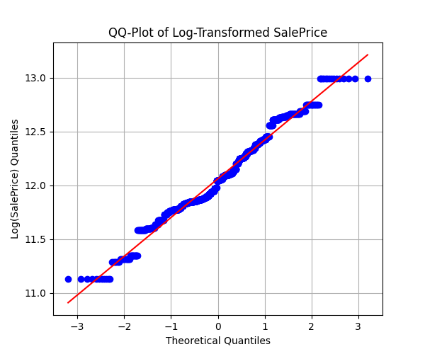
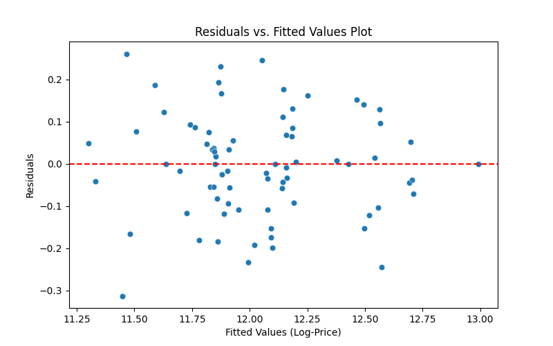

# 📈 Análisis y Modelo de Predicción de Precios de Vivienda (Ames, Iowa)

Este proyecto analiza el dataset "Ames Housing" para identificar los factores clave que influyen en el precio de venta de las viviendas y para construir un modelo de regresión lineal múltiple (MLR) que prediga dicho precio.

**Objetivo de Negocio:** Proveer a los agentes inmobiliarios de una herramienta de tasación basada en datos y generar insights estadísticos para el "Ames City Real Estate Report".

**Stack Tecnológico:** `Python` `Pandas` `Numpy` `Statsmodels` `Scikit-learn` `Matplotlib` `Seaborn`

---

## 📊 Resultados Clave del Modelo

Puse los hallazgos principales al inicio para un resumen rápido.

* **Precisión del Modelo (RMSE):** El modelo final puede predecir el precio de una vivienda con un **error promedio de $21,579**.
* **Explicabilidad (Adj. R-squared):** El modelo explica el **89.5% de la varianza** en los precios de las viviendas.
* **Principales Drivers de Precio (p < 0.05):**
    * **`OverallQual` (Calidad General):** El factor más significativo. Por cada punto de aumento en la calidad, el precio de la vivienda aumenta aproximadamente un **5.5%** .
    * **`GrLivArea` (Metros Cuadrados):** Un factor clave de predicción.
    * **`Neighborhood` (Barrio):** La ubicación tiene un impacto estadísticamente significativo en el precio (demostrado por prueba ANOVA) .
    * **`CentralAir` (Aire Acondicionado):** Tener aire acondicionado central supone un aumento de precio cercano al **30%**.

---

## 🔬 Metodología de Análisis

El proyecto siguió un flujo de trabajo estadístico riguroso dividido en 5 fases.

### Fase 1: Análisis Exploratorio de Datos (EDA)
Se analizaron las variables para entender sus relaciones. La variable objetivo, `SalePrice`, presentaba una fuerte asimetría (skewness), lo cual viola los supuestos de la regresión lineal.



A su vez, la diferencia entre media (185261.4) y mediana (170000.0) nos indica la posible presencia de outliers (valores extremos en la muestra que alteran la distribución).

Por otro lado, se diseñó una tabla de correlación para determinar que variables estaban más relacionadas con la variable target: 


Una vez determinadas, se representó su relación con el SalePrice, a través de un scatter plot si la variable era numérica o un box plot si la variable era categórica: 





### Fase 2: Transformación de Datos y Normalidad
Para corregir la asimetría, se aplicó una **transformación logarítmica** (`np.log`) a `SalePrice`. Los gráficos QQ-Plot confirmaron que la variable transformada se ajusta mucho mejor a una distribución normal, un paso crítico para un modelo robusto .




### Fase 3: Pruebas de Hipótesis y Selección de Features
Se usaron pruebas estadísticas formales para validar la inclusión de predictores:
* **T-Test:** Confirmó que tener `CentralAir` tiene un impacto estadísticamente significativo en el precio (p < 0.05).
* **ANOVA:** Confirmó que `Neighborhood` es un predictor significativo.
* **Matriz de Correlación:** Identificó las variables numéricas más fuertes, como `OverallQual` y `GrLivArea`..


### Fase 4: Construcción del Modelo de Regresión (MLR)
Se construyó un modelo de Regresión Lineal Múltiple (`statsmodels.api.OLS`) usando los predictores validados. Las variables categóricas (como `Neighborhood`) se transformaron usando `pd.get_dummies`.

### Fase 5: Diagnóstico y Validación del Modelo
El modelo fue validado comprobando los supuestos de la regresión.
* El **análisis de residuos** mostró una nube de puntos aleatoria (homoscedasticidad), lo que confirma que el modelo es fiable.
* El **QQ-Plot de los residuos** confirmó que los errores del modelo se distribuyen normalmente.



###Fase 6: Plan de acción
El modelo no solo predice precios con una alta precisión (explica el 89.5% de la varianza), sino que también genera valor de negocio directo. Basado en los resultados, las acciones recomendadas son:

* **Insights Estadísticos para Marketing y Ventas:**

Enfocar la Venta en la Calidad: El modelo prueba que OverallQual (Calidad General) es el factor con mayor impacto. Los agentes deben usar esto para justificar precios y aconsejar a los clientes sobre renovaciones rentables.

Cuantificar el Valor de las Comodidades: Podemos afirmar con datos que CentralAir añade un valor significativo (cercano al 30%). Esto justifica su instalación como una inversión clave antes de vender.

* **Acción Recomendada (Despliegue):**

Crear una Herramienta de Tasación Interna: El siguiente paso lógico es convertir este script en una aplicación web simple (usando Streamlit o Flask).

Resultado: Los agentes podrían introducir las características de una propiedad y recibir una tasación instantánea (ej. "$195,000 ± $21,579"), estandarizando las tasaciones y dándoles una ventaja competitiva basada en datos.
---

## 🚀 Próximos Pasos (Futuras Mejoras)

Aunque el modelo MLR es robusto, asume relaciones lineales. El siguiente paso es explorar modelos más complejos para capturar la "disminución de rendimientos" (ej. el valor de un m² extra es menor en una mansión que en una casa pequeña.

* **Regresión Polinómica:** Añadir términos cuadráticos (ej. `GrLivArea^2`).
* **Regresión con Splines:** Usar `bs(GrLivArea, df=6)` para un ajuste más flexible.
* **Modelos Aditivos Generalizados (GAM):** Usar `pygam` para encontrar automáticamente las mejores curvas no lineales para `GrLivArea` y `YearBuilt`.

---

## 💻 Cómo Ejecutar este Proyecto

1.  Clona el repositorio:
    ```bash
    git clone [https://github.com/tu_usuario/Tu-Repositorio.git](https://github.com/tu_usuario/Tu-Repositorio.git)
    cd Tu-Repositorio
    ```
2.  Crea un entorno virtual e instala las dependencias:
    ```bash
    # (Opcional pero recomendado)
    python -m venv venv
    source venv/bin/activate  # En Windows usa `venv\Scripts\activate`
    
    # Instalar librerías
    pip install -r requirements.txt
    ```
3.  Ejecuta el script de análisis:
    ```bash
    python HousePrice_Analysis.py
    ```

---

**Contacto:**
* [José Ignacio Rubio]
* [www.linkedin.com/in/josé-ignacio-rubio-194471308]
